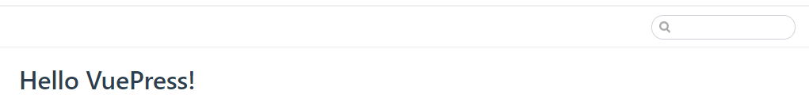

# 使用VuePress搭建在线文档网站

## 1. 了解VuePress

- VuePress 在线文档: [https://www.vuepress.cn/](https://www.vuepress.cn/)
- github pages在线文档例子: https://zxfjd3g.github.io/jQuery-study_docs/


## 2. 下载安装相关软件

### 2.1. Typora

- 说明: markdown文件编辑器

- 下载: https://www.typora.io/#

- 安装: 正常安装即可 (最好在非中文路径下)

- 配置自动保存图片的路径(文件 ==> 偏好设置 ==> 图像)

  


### 2.2. Node

- 说明: 提供前端js运行环境, 且提供了npm工具包(用来下载其它第三方工具包)

- 下载: http://nodejs.cn/download/

- 安装: 正常安装即可 (最好在非中文路径下)

- 配置npm淘宝镜像, 提升npm下载速度

  ```shell
  npm config set registry http://registry.npm.taobao.org/
  ```


## 3. 快速体验 VuePress

```shell
# 全局下载vuepress
npm install -g vuepress

# 在指定空文件夹中创建 README.md, 并指定简单标题内容
# Hello VuePress!

# 开发环境运行
vuepress dev .

# 打包生成本地静态文件
vuepress build .
```

- 运行效果




## 4. 搭建 一个完整的文档项目

> 以改造宋老师的 jQuery 课件为例
>
> 需要将原始课件的md文件拆分成多个文件

::: warning 注意

以改造宋老师的 jQuery 课件为例

需要将原始课件的md文件拆分成多个文件

:::

::: tip 注意

以改造宋老师的 jQuery 课件为例

需要将原始课件的md文件拆分成多个文件

:::

::: danger 注意

以改造宋老师的 jQuery 课件为例

需要将原始课件的md文件拆分成多个文件

:::


### 4.1. 创建一个空项目

- 新建一个空文件夹: xxx_docs
- 生成 package.json

```shell
npm init -y
```


### 4.2. 创建主体文件目录结构

```
|-- docs
	|-- .vuepress
		|-- config.js
	|-- README.md
```


### 4.3. 放入MD课件

```
|-- docs
    |-- .vuepress
    	|-- public
    		|-- favicon.ico
    		|-- logo.png
    		|-- jQuery.jpg
    	|-- config.js
	|-- chapter1
		|-- images
			|-- 当前章节的相关图片
        |-- 第1章 jQuery简介.md
        |-- 第2章 jQuery快速入门.md
        |-- 第3章 jQuery基本语法.md
        |-- 第4章 jQuery选择器（重点）.md
        |-- 第5章 文档处理（CRUD）.md
        |-- 第6章 jQuery操作DOM.md
        |-- 第7章 事件.md
        |-- 第8章 效果（选学）.md
        |-- 面试题.md
    |-- chapterLast
        |-- README.md
	|-- README.md
```


### 4.4. docs/.vuepress/config.js

```js
module.exports = {
  base: '/jQuery_study/', /* 基础虚拟路径 */
  dest: 'docs/dist', /* 打包文件基础路径, 在命令所在目录下 */
  title: 'jQuery 快速上手', // 标题
  description: '尚硅谷Java研究院', // 标题下的描述
  themeConfig: { // 主题配置
    logo: '/logo.png',
    nav: [
      { text: '官网', link: 'http://www.atguigu.com' },
      { text: '谷粒学院', link: 'http://www.gulixueyuan.com/' },
      { 
        text: '学习路线', 
        items: [
          { text: 'Java', link: 'http://www.atguigu.com/kecheng.shtml' },
          { text: '前端', link: 'http://www.atguigu.com/web/' },
          { text: '大数据', link: 'http://www.atguigu.com/bigdata/' }
        ] 
      },
    ],
    sidebar: [ // 左侧导航
      {
        title: 'jQuery快速入门', // 标题
        collapsable: false, // 下级列表不可折叠
        children: [ // 下级列表
          'chapter1/第1章 jQuery简介',
          'chapter1/第2章 jQuery快速入门',
          'chapter1/第3章 jQuery基本语法',
          'chapter1/第4章 jQuery选择器（重点）',
          'chapter1/第5章 文档处理（CRUD）',
          'chapter1/第6章 jQuery操作DOM',
          'chapter1/第7章 事件',
          'chapter1/第8章 效果（选学）',
          'chapter1/面试题',
        ]
      },
      'chapterLast/',
    ]
  },

  head: [ 
    // 指定网页标题图标
    ['link', { rel: 'shortcut icon', type: "image/x-icon", href: `./favicon.ico` }]
  ]
}
```


### 4.5. docs/README.md

```bash
---
#首页
home: true  
# 图标
heroImage: /jQuery.jpg
# 按钮文本
actionText: 开始学习 →
# 按钮点击跳转路径
actionLink: /chapter1/第1章 jQuery简介
# 特性说明
features: 
- title: jQuery说明标题1
  details: jQuery说明内容1jQuery说明内容1jQuery说明内容1jQuery说明内容1
- title: jQuery说明标题2
  details: jQuery说明内容2jQuery说明内容2jQuery说明内容2jQuery说明内容2
- title: jQuery说明标题3
  details: jQuery说明内容3jQuery说明内容3jQuery说明内容3jQuery说明内容3
---
```


### 4.6. package.json  

```json
"scripts": {
  "doc:dev": "vuepress dev docs",
  "doc:build": "vuepress build docs",
  "doc:deploy": "gh-pages -d docs/dist"
}
```

::: warning 运行项目
npm run doc:dev
:::


## 5. 发布到git pages

- 创建一个远程仓库 jQuery-study_docs

- 下载 gh-pages: npm i gh-pages

- 修改docs/.vuepress/config.js: base: '/jQuery-study_docs/'

- 打包文档: npm run doc:build

- 将项目推送到github

  - 创建 .gitignore, 并配置忽略

    ```
    .vscode
    node_modules
    ```

  - git init

  - git add .

  - git commit -m "init"

  - git remote add origin https://github.com/zxfjd3g/jQuery-study_docs.git

  - git push origin master

- 发布文档: npm run doc:deploy

- 访问在线文档: https://zxfjd3g.github.io/jQuery-study_docs/


## 6. 修改文档

- 修改文档内容
  - npm run doc:dev
  - 修改文档内容  ==> 直接查看最新效果
  - 注意: 修改一级或二级标题, 菜单导航不会实时更新 ==> 需要重新运行
- 推送修改的文档到远程:
  - npm run doc:build
  - npm run doc:deploy


